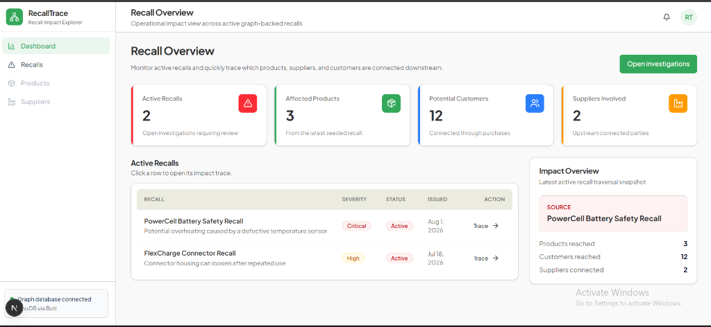
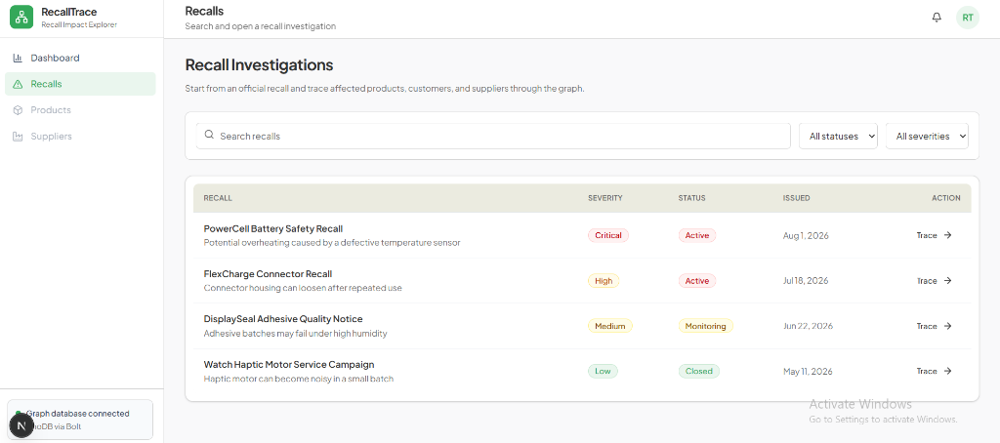
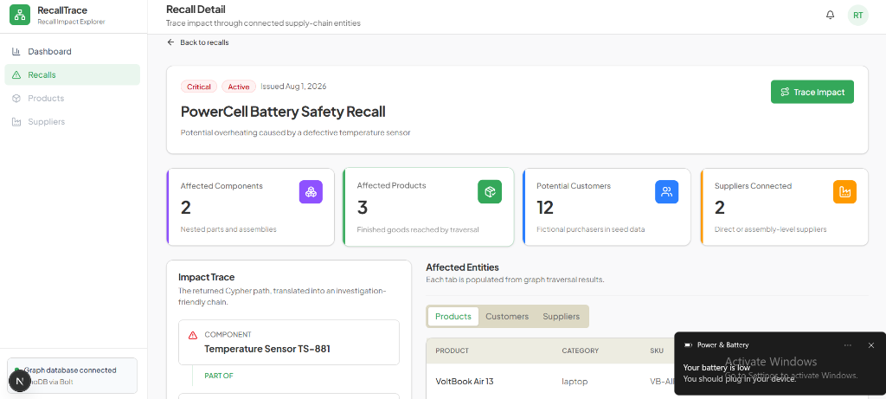
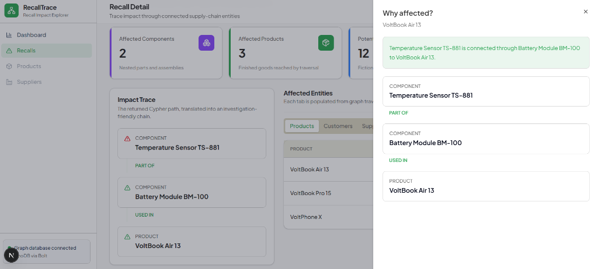
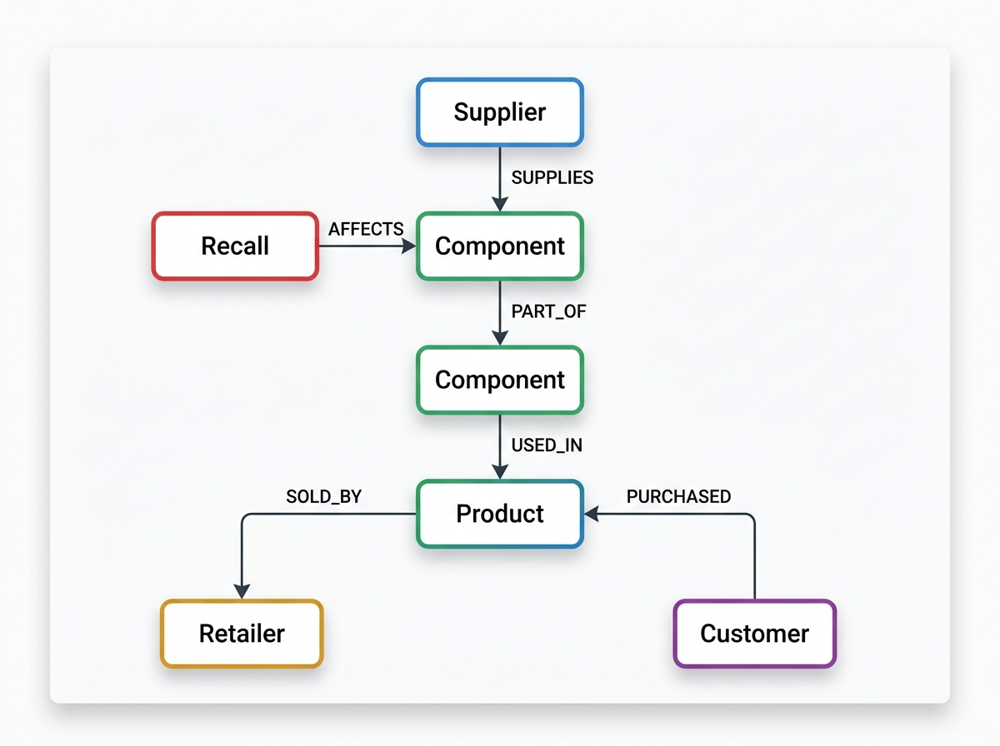

# RecallTrace

> A graph-powered product recall impact explorer built with CognoDB, NestJS, Next.js, and TypeScript.

RecallTrace helps product safety and operations teams understand the downstream impact of a product recall.

Starting from a recalled component, the application traverses connected components, assemblies, products, suppliers, retailers, and customers to answer questions such as:

- Which products are affected by this recall?
- How is a recalled component connected to an affected product?
- Which customers may have purchased affected products?
- Which suppliers are connected to the recalled component?
- Why is a specific customer or product affected?

The application presents these graph relationships through a simple operations dashboard and an investigation-focused recall details experience.

---

## Demo

**Live Demo:** _Add hosted application URL_

**Screen Recording:** _Add screen recording URL_

---

## Application Screenshots

### Dashboard



### Recalls



### Recall Investigation



### Impact Trace



---

# The Problem

Product recalls can affect more than a single product.

A defect may begin with a relatively small component that is incorporated into a larger module or assembly. That assembly may then be used in multiple finished products, sold through different retailers, and ultimately purchased by many customers.

For example:

```text
Defective Temperature Sensor
            │
            │ PART_OF
            ▼
      Battery Module
            │
            │ PART_OF
            ▼
     Battery Assembly
            │
            │ USED_IN
            ▼
      VoltBook Pro 15
            │
            │ PURCHASED
            ▼
        Customer
```

---

## Data Model

RecallTrace uses six node types:

- `Recall`
- `Component`
- `Product`
- `Supplier`
- `Retailer`
- `Customer`

### Graph Structure



### Relationships

| Relationship | Meaning |
|---|---|
| `AFFECTS` | Recall → Component |
| `SUPPLIES` | Supplier → Component |
| `PART_OF` | Component → Component |
| `USED_IN` | Component → Product |
| `SOLD_BY` | Product → Retailer |
| `PURCHASED` | Customer → Product |
